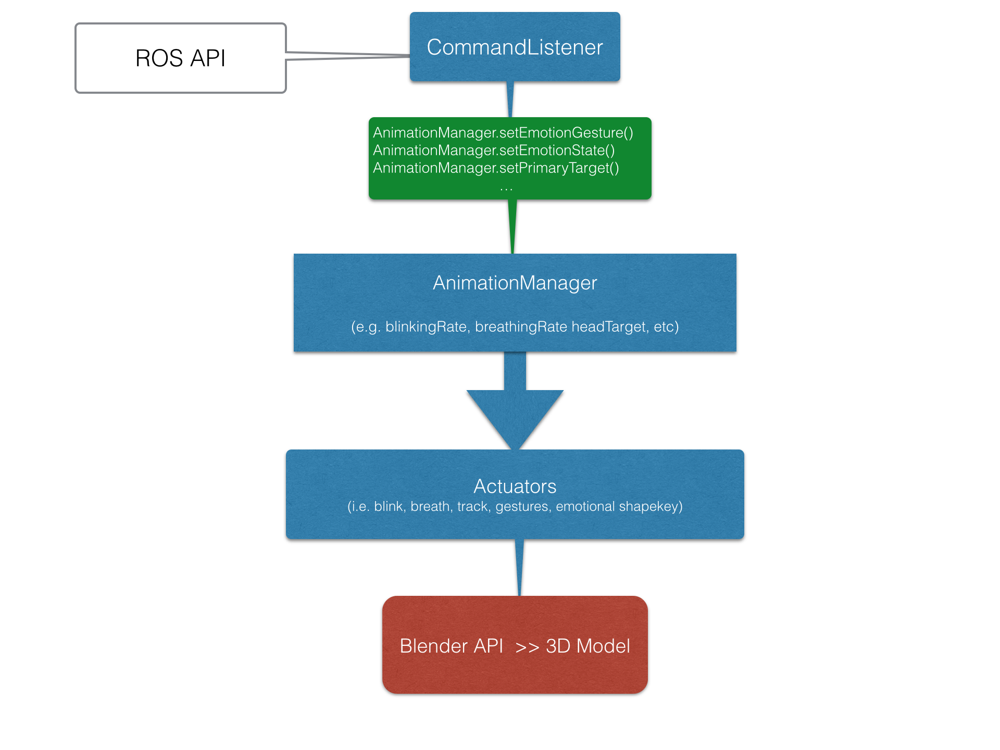

# Eva Blender Animation API #

This repository contains an animated model of the Eva head, as a
Blender file.  The head is driven by a collection of Python scripts
known as the rigControl module. These controls can be activated from
the blender interface, or by sending specially crafted messages to a
listener daemon.

This youtube video shows what is currently possible:
[Eva demo](https://www.youtube.com/watch?v=ICDo_DQbjwQ)

# Running #

Pre-requisites: The code is designed for Blender 2.72 or higher. If you are on Blender 2.69 (That comes with Ubuntu) and has issues with eva.blend. Try eva269.blend.

 * Start Blender, load Eva.blend.
 * If Eva's face looks distorted, make sure you follow the next step.
 * From the top status bar, click on 'Reload Trusted' if a security prompt exists.
 * This will bring up a RigControl panel on the right.
 * Click on "Start Animation" to initialize the character.
 * The character should now be live, as indicated by eye movement and blinking.
 * One can control Eva by using the graphic interface provided.

# Command Listener #
* Comands may be sent through ROS to control Eva.
* 'Command Listener' must be started in the RigControl Panel before commands are to be accepted.
* The API is currently in draft stage: [API_v1](docs/API_v1.md)

# Design #

The CommandListener listens for and parses command from ROS.

The AnimationManager keeps track of of Eva's internal state.

The Actuators are responsible individual actions of Eva such as breathing, blinking, eye movement.

All the animation sequences and 3D data are stored in the Blender file.

# Copyright #

Copyright (c) 2014 Hanson Robotics

Copyright (c) 2014 Mike Pan

