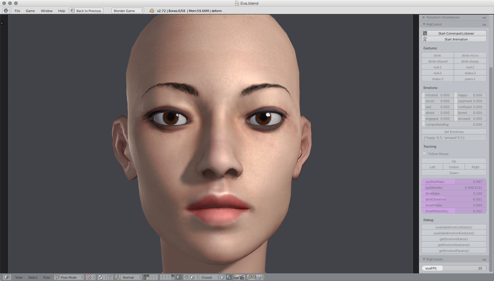

# Eva Blender Animation API #

This repository contains an animated model of the Eva head, as a
Blender file, as well as a Robot Operating System (ROS) node to control
the model.  The ROS node is automatically started when the blender
file is loaded.

The rigControl python module contains scripts to drive the model, as
well as defining a public programming API.  The rosrig python module
contains ROS node implementation.  The rigAPI module defines an abstract
base class for controlling the rig: the ROS node uses this API, and
rigControl implements it.




This youtube video shows what is currently possible:
[Eva demo](https://www.youtube.com/watch?v=ICDo_DQbjwQ)

# Running #

Pre-requisites: The code is designed for Blender 2.72 or higher. If
you are on Blender 2.69 (that comes with Ubuntu) and have issues with
eva.blend, try eva269.blend instead.  Note: eva269.blend is missing
some of the newer fixes, including a camera location fix.

Start blender as follows:
```
blender -y Eva.blend -P autostart.py
```
Eva can be controlled via buttons in the blender GUI (note the panel
on the right).  A HOWTO guide for manipulating via ROS can be found in
the [Eva cookbook](docs/cookbook.md) in the `docs` directory.


# Design #
The programming API is currently in draft stage, here: 
[API_v1](docs/API_v1.md). What has actually been implemented does not
match the proposed API; neither is "authoritative", both probably need
revision.


* The ROS node listens to and acts on ROS messages.  It uses the
  abstract base class `rigAPI` to communicate with blender.
* Animation messages are queued with the `CommandSource.py` module.
* The `CommandListener` listens to `CommandSource` messages; these
  are `'rigAPI` messages.
* The `command.py` module implements the `rigAPI`
* The `AnimationManager` keeps track of of Eva's internal state.
* The `Actuators` are responsible individual actions of Eva such as
  breathing, blinking and eye movement.

All animation sequences and 3D data are stored in the Blender file.

# Copyright #

Copyright (c) 2014,2015 Hanson Robotics

Copyright (c) 2014,2015 Mike Pan
